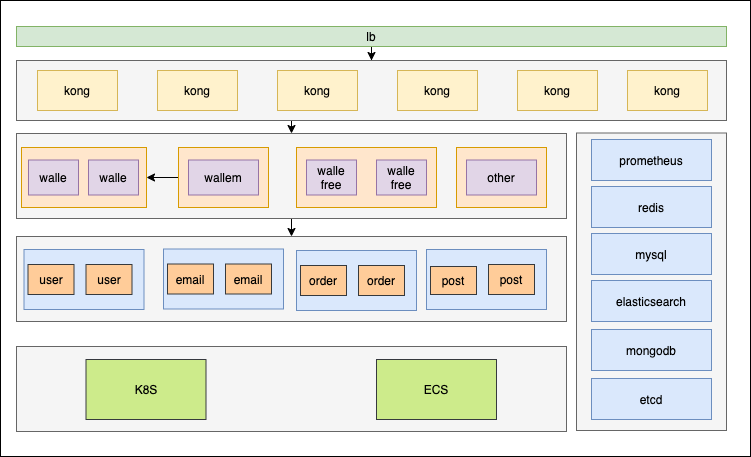

# eva

cmd组件

|组件|功能|备注|
|:-----| ----: | :----: |
|protoc-gen-eva|protobuf plugin，用以生成proto代码|cmd/protoc-gen-eva|
|eva|脚手架工具 用来生成代码|cmd/eva|

要求:
protoc-gen-go 1.3.2

go get -u github.com/Gitforxuyang/eva/cmd/protoc-gen-eva或者go install 

go get -u github.com/Gitforxuyang/eva/cmd/eva 或者go install

```
使用命令创建项目，要求首字母小写。多字母时使用驼峰命名规范
eva -name=xxx -port=xxx 

创建成功后进入目录执行
make proto
go get 
执行
go run main.go 
即可启动项目
```
```
功能
1.sentry上报。通过配置sentry地址即可使用sentry上报panic
2.链路追踪 可通过配置中的trace决定打开哪些组件的链路。使用log决定是否开启更详细的出入参数记录
3.日志打印 是用logger.getLogger()获得全局日志打印对象进行打印
```
待做：
```
1.其它plugin mysql/es/tablestore/broker 
2.api server自动注册并发现服务 
3.单元测试
```

